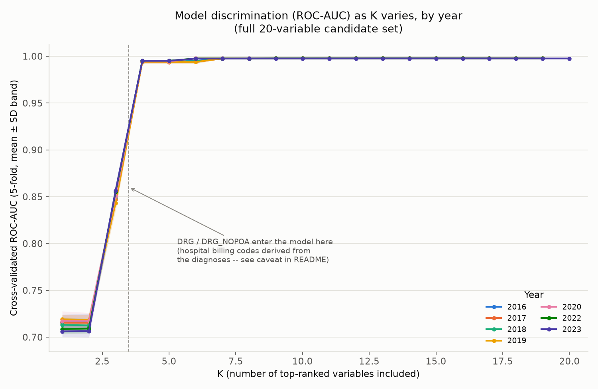
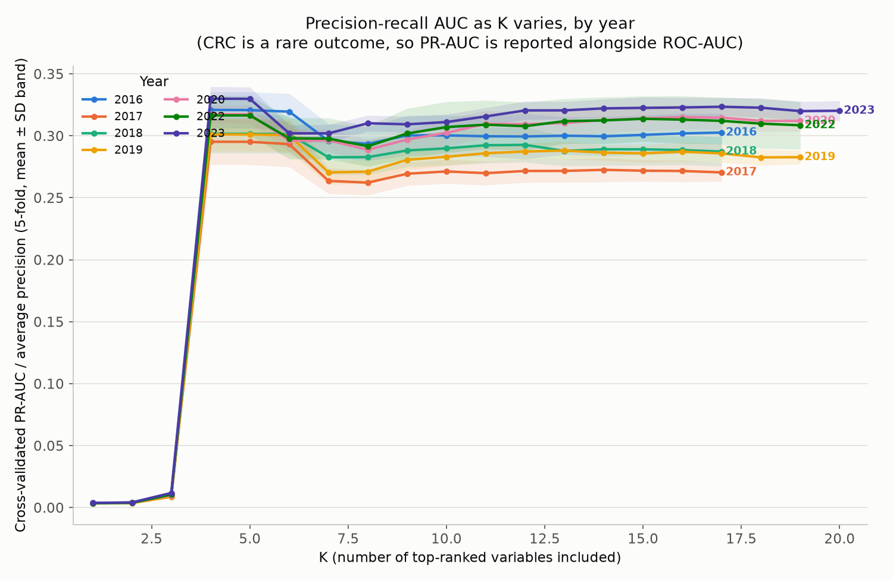
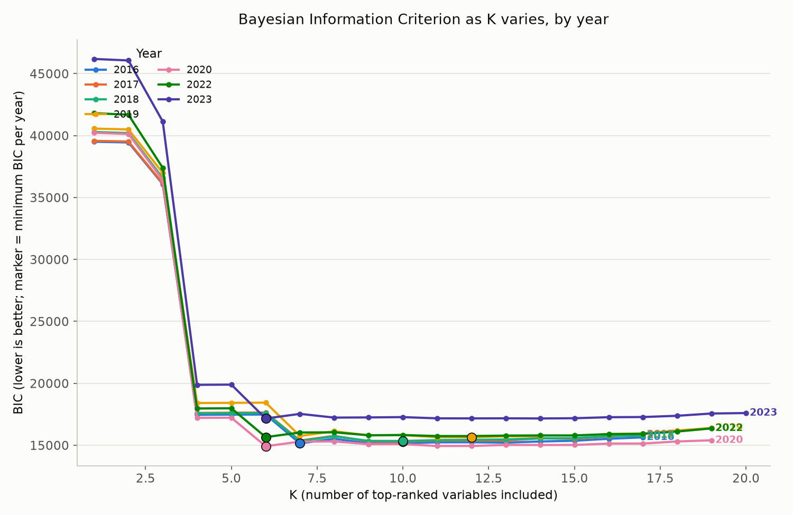
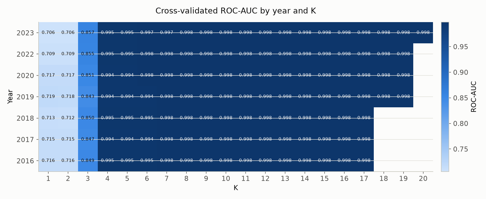
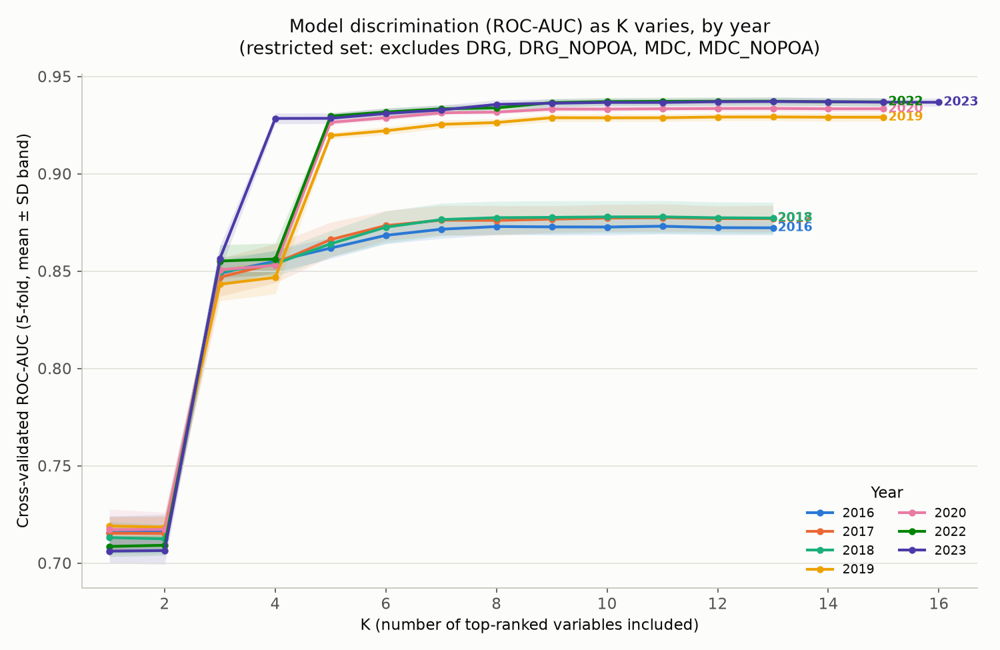
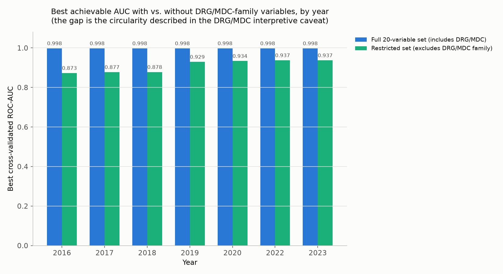
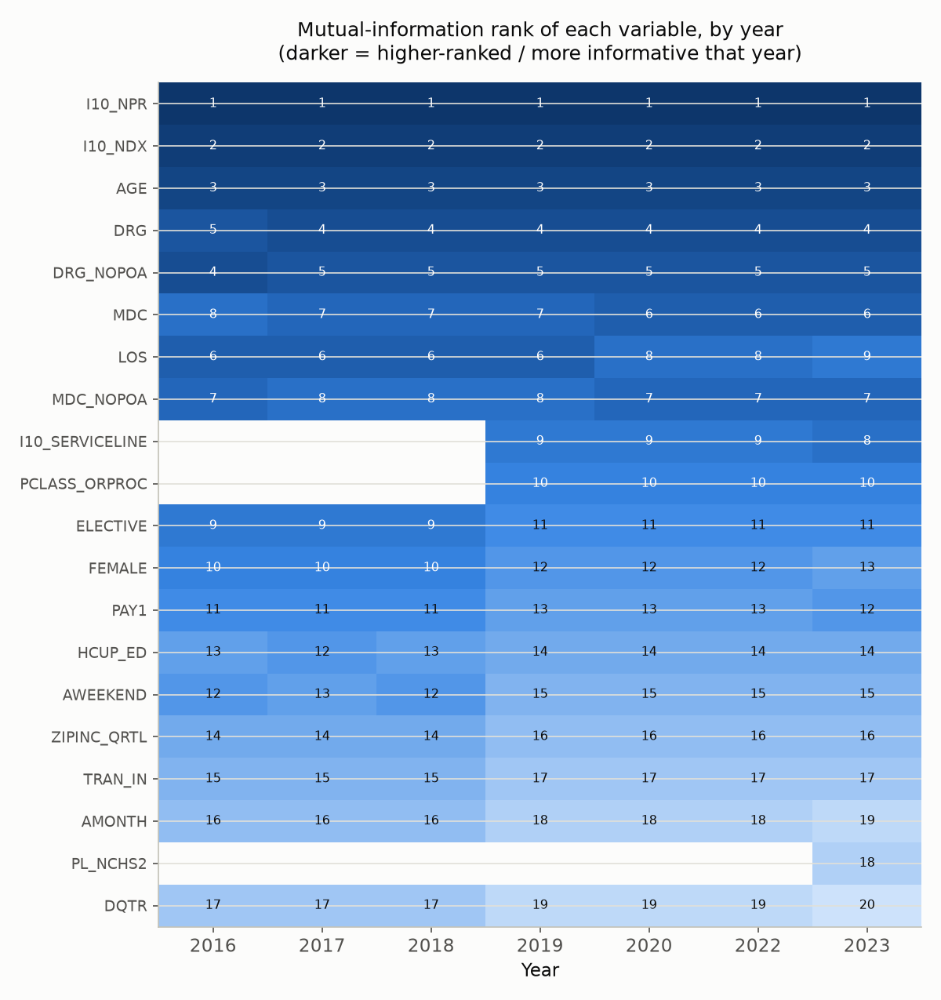
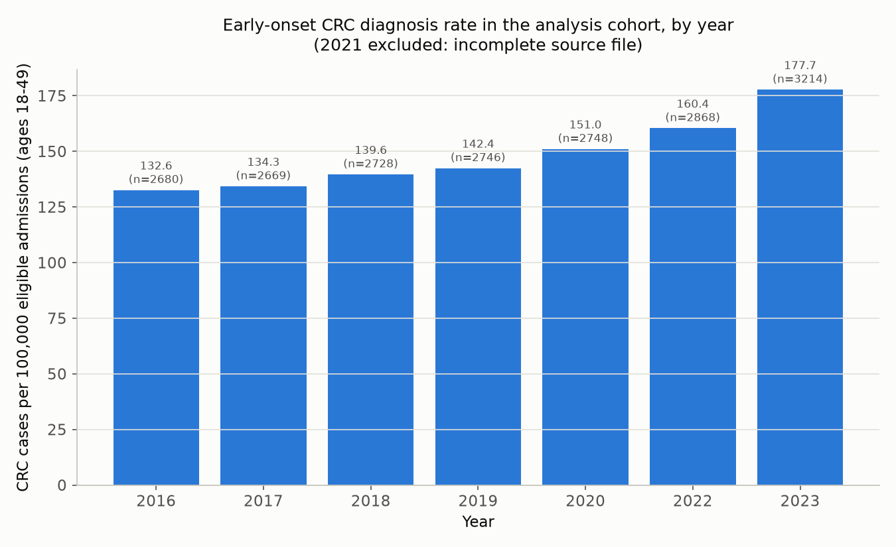

# CRC Top-K Findings

**Which admission variables actually predict early-onset colorectal cancer — and which only look like they do**

Research findings · HCUP NIS 2016–2023 · Cohort: ages 18–49 · Years analyzed: 2016–2020, 2022–2023 · Date: 2026-08-20

A multi-year Top-K feature-selection sweep over the 20 screened candidate variables, run independently for every usable NIS year, surfaces one result that changes how the next modeling stage should be built.

> For the full narrative history of the project (cohort definitions, exclusion criteria, the original single-year screening) see [`PROJECT_PROGRESS_REPORT.md`](PROJECT_PROGRESS_REPORT.md). For reproduction instructions and repository structure see [`README.md`](README.md). This document is the results/findings write-up.

---

## High-level summary

Varying K (the number of top mutual-information-ranked variables retained) from 1 to 20, independently for each of 7 years, gives a consistent answer — but only after removing two variables that make the model look far better than it is.

| | | | |
|---|---|---|---|
| **7 / 8 years** | **0.998** | **0.87–0.94** | **K = 7–9** |
| 2021 excluded — source file truncated to ~500K rows vs. ~7M expected | Reported AUC once DRG/MDC billing codes enter — misleadingly high, see caveat below | True AUC ceiling with DRG/MDC excluded, at 7–9 clinically real variables | Parsimonious variable count statistically indistinguishable from the best model, every year |

- **The variable ranking is remarkably stable across all 7 years** — `I10_NPR`, `I10_NDX`, and `AGE` are the top 3 predictors in every single year, with no exceptions.
- **DRG and MDC are not real predictors — they're the outcome in disguise.** Both are hospital billing codes computed from the discharge's own diagnosis list, so including them lets the model "predict" CRC by reading a code that already encodes the CRC diagnosis. This is the main finding of this analysis.
- **Once DRG/MDC are excluded, predictive power genuinely improved after 2019** — AUC rises from ~0.87–0.88 (2016–2018) to ~0.93–0.94 (2019–2023), tracking two variables (`I10_SERVICELINE`, `PCLASS_ORPROC`) that only exist in the Core file from 2019 onward.
- **Early-onset CRC diagnoses rose 34% over the study window** — from 132.6 to 177.7 cases per 100,000 eligible admissions, 2016 to 2023, consistent with the literature on rising early-onset incidence.
- **Recommendation:** carry a 7–9 variable, DRG/MDC-free covariate set forward into the STEROID_EXPOSURE-adjusted model (see [Recommendation](#9-recommendation-for-the-next-modeling-stage)).

---

## Contents

1. [Objective & scope](#1-objective--scope)
2. [Data & cohort](#2-data--cohort)
3. [Methodology](#3-methodology)
4. [Results: full variable set](#4-results-full-20-variable-set)
5. [The DRG/MDC caveat](#5-the-drgmdc-caveat)
6. [Results: restricted variable set](#6-results-restricted-variable-set)
7. [Cross-year consistency](#7-cross-year-consistency)
8. [CRC rate trend (context)](#8-crc-rate-trend-2016-2023)
9. [Recommendation](#9-recommendation-for-the-next-modeling-stage)
10. [Limitations](#10-limitations)

---

## 1. Objective & scope

The prior screening stage ranked 20 candidate covariates by mutual information with CRC, using the 2023 cohort only. The open question, posed by the project supervisor, was how many of those top-ranked variables should be retained for modeling — and whether that answer is stable across years.

This analysis answers both parts: it varies K from 1 to 20, scores each K by cross-validated discrimination, and repeats the entire sweep independently for every usable HCUP NIS year from 2016 to 2023. It is a **predictive screening** exercise — it identifies which covariates carry information about CRC in this cohort, not which ones cause it. The one exception, and the reason this document exists, is that one pair of "predictors" turned out to carry the outcome itself.

## 2. Data & cohort

Seven NIS years, rebuilt from raw Core files through one unified cohort pipeline, restricted to hospital admissions aged 18–49 after CRC identification, exclusion criteria, and steroid-exposure flagging.

> **Excluded · 2021** — `NIS_2021_Core.csv` on the source disk contains only ~500,000 rows, versus ~6.5–7.2 million for every other year — consistent with a truncated download rather than a genuine change in NIS sampling. Confirmed with the project owner to exclude 2021 rather than analyze a non-representative year.

**Cohort size and CRC burden by year**

| Year | Cohort (n) | CRC cases | CRC / 100k | Steroid-exposed |
|---|---:|---:|---:|---:|
| 2016 | 2,021,244 | 2,680 | 132.6 | 51,830 |
| 2017 | 1,987,850 | 2,669 | 134.3 | 51,657 |
| 2018 | 1,953,919 | 2,728 | 139.6 | 50,853 |
| 2019 | 1,928,260 | 2,746 | 142.4 | 50,571 |
| 2020 | 1,819,316 | 2,748 | 151.0 | 44,602 |
| 2022 | 1,788,156 | 2,868 | 160.4 | 43,675 |
| 2023 | 1,808,602 | 3,214 | **177.7** | 45,154 |

**Variable availability varies by year** — detected directly from each year's header, not assumed:

- `I10_SERVICELINE`, `PCLASS_ORPROC` — available 2019 onward only (17 of 20 variables available for 2016–2018)
- `PL_NCHS2` — available in 2023 only, in this data pull (19 of 20 available 2019–2022)
- Diagnosis positions scanned for CRC/exclusion/exposure logic: 30 positions in 2016, 40 positions from 2017 onward

## 3. Methodology

Rank, sweep, encode, evaluate — repeated independently for every year, plus a second pass with the circular variables removed.

**Ranking.** Within each year, the available candidate variables are ranked by mutual information with `CRC`, using the same chi-square / mutual-information / univariate-logistic screening as the original 2023-only analysis. The resulting rank order is remarkably stable across years — see [Cross-year consistency](#7-cross-year-consistency).

**Sweeping K.** For K = 1 up to the number of available variables, the top-K ranked variables are used to fit a logistic regression predicting `CRC`, scored by:

- **5-fold stratified cross-validated ROC-AUC and PR-AUC** — the primary metrics. PR-AUC (average precision) is reported alongside ROC-AUC because CRC prevalence is well under 1% in every year, and ROC-AUC alone can overstate performance under severe imbalance.
- **AIC / BIC / McFadden's pseudo-R²** from a full-sample fit — a parsimony check, since BIC in particular penalizes added parameters.
- **Elbow K** — the smallest K whose AUC is within 0.002 of that year's maximum: the simplest model statistically indistinguishable from the best one found.

**Encoding.** The 20 variables mix continuous, binary, and categorical types at very different cardinalities:

| Bucket | Variables | Encoding |
|---|---|---|
| Continuous | `AGE`, `LOS`, `I10_NDX`, `I10_NPR` | Standardized (z-score) |
| Binary | `AWEEKEND`, `ELECTIVE`, `FEMALE`, `HCUP_ED`, `TRAN_IN` | Passthrough (0/1) |
| Low-cardinality (≤50 cat.) | `AMONTH`, `DQTR`, `PAY1`, `ZIPINC_QRTL`, `PL_NCHS2`, `I10_SERVICELINE`, `PCLASS_ORPROC`, `MDC`, `MDC_NOPOA` | One-hot |
| High-cardinality (>50 cat.) | `DRG`, `DRG_NOPOA` (~750 codes each) | Target-encoded (cross-fitted) |

The cardinality split is data-driven at runtime, not hardcoded. `DRG`/`DRG_NOPOA` are target-encoded rather than one-hot to keep the design matrix tractable — one-hot encoding two ~750-category variables would add ~1,500 columns per model across ~1.8–2.0 million rows.

## 4. Results: full 20-variable set

Every year traces the same shape — a real climb through K=3, then an artificial leap at K=4 that this analysis exists to explain.

*Figure 1. Cross-validated ROC-AUC vs. K, full candidate set, all 7 years overlaid. AUC starts near 0.71 (K=1, `I10_NPR` alone), reaches ~0.85 by K=3, then jumps to ~0.995–0.998 the instant `DRG`/`DRG_NOPOA` enter at K=4.*

**Best/elbow K by year — full variable set**

| Year | Best K (max AUC) | Best AUC | Best K by BIC | Elbow K | AUC at elbow | Vars avail. |
|---|---:|---:|---:|---:|---:|---:|
| 2016 | 13 | 0.9979 | 7 | 7 | 0.9978 | 17 |
| 2017 | 12 | 0.9977 | 10 | 7 | 0.9976 | 17 |
| 2018 | 14 | 0.9977 | 10 | 7 | 0.9976 | 17 |
| 2019 | 13 | 0.9977 | 12 | 7 | 0.9975 | 19 |
| 2020 | 15 | 0.9979 | 6 | 6 | 0.9977 | 19 |
| 2022 | 15 | 0.9977 | 6 | 6 | 0.9976 | 19 |
| 2023 | 17 | 0.9976 | 6 | 6 | 0.9974 | 20 |

BIC bottoms out at K=6–7 in every year — past that point, additional variables cost more BIC penalty than they return in log-likelihood. "Best K by BIC" and "elbow K" agree almost exactly across all 7 years, independent of the DRG/MDC issue below.

Additional full-set figures (PR-AUC, BIC, and the year×K AUC heatmap)

*Figure 1b. PR-AUC vs. K — same shape as ROC-AUC, but years separate more visibly in the K=7–20 plateau.*

*Figure 1c. BIC vs. K, per year, with each year's minimum marked.*

*Figure 1d. Year × K heatmap of AUC — full numeric grid.*

## 5. The DRG/MDC caveat

This is the finding this whole exercise was designed to surface. It changes what "K" should mean for the next modeling stage.

> **Not a real predictor.** `DRG` and `DRG_NOPOA` (Diagnosis Related Group) — and to a lesser extent `MDC`/`MDC_NOPOA` (Major Diagnostic Category) — are **hospital-assigned billing/grouping codes computed from the discharge's own diagnosis codes**, including the CRC diagnosis itself when CRC is the principal diagnosis. A GI-malignancy-specific DRG/MDC grouping exists, so once a patient's diagnoses are known, DRG/MDC already encode whether this was a cancer admission. Including them in a model that predicts CRC from that same admission's characteristics is close to circular: the outcome is leaking back in through a derived administrative code, not through a genuine risk signal.

The AUC≈0.998 ceiling in the full-set results above is a direct consequence of this. **It should not be reported or interpreted as "admission characteristics predict CRC with 99.8% AUC."** It largely reflects that DRG/MDC restate the diagnosis list the outcome was defined from.

To answer the scientifically meaningful version of the question — how well do the *clinically interpretable* candidate variables predict CRC — the entire sweep was repeated with these four variables removed from the candidate set:

~~`DRG`~~ &nbsp; ~~`DRG_NOPOA`~~ &nbsp; ~~`MDC`~~ &nbsp; ~~`MDC_NOPOA`~~

## 6. Results: restricted variable set

With the circular variables removed, a much more defensible — and more interesting — picture emerges.

*Figure 2. Cross-validated ROC-AUC vs. K, restricted set (DRG/DRG_NOPOA/MDC/MDC_NOPOA excluded). Two distinct plateaus by era, not one continuous curve.*

**Best/elbow K by year — restricted variable set**

| Year | Best K (max AUC) | Best AUC | Best K by BIC | Elbow K | AUC at elbow | Vars avail. |
|---|---:|---:|---:|---:|---:|---:|
| 2016 | 11 | 0.8730 | 8 | 7 | 0.8715 | 13 |
| 2017 | 11 | 0.8774 | 9 | 7 | 0.8761 | 13 |
| 2018 | 11 | 0.8778 | 8 | 7 | 0.8765 | 13 |
| 2019 | 13 | 0.9292 | 9 | 9 | 0.9288 | 15 |
| 2020 | 13 | 0.9336 | 9 | 8 | 0.9317 | 15 |
| 2022 | 13 | 0.9373 | 9 | 9 | 0.9366 | 15 |
| 2023 | 13 | 0.9371 | 10 | 8 | 0.9356 | **16** |

*Figure 3. The gap between the two bars, in every year, is the size of the DRG/MDC circularity problem — not a genuine improvement in predictive information.*

The 2016–2018 vs. 2019–2023 step change lines up exactly with `I10_SERVICELINE` and `PCLASS_ORPROC` becoming available in 2019 — both rank in the restricted top-6 every year they exist, and both carry real, non-circular clinical information (service line and procedure classification are set largely independent of whether the diagnosis was CRC). This is a genuine, reproducible gain in predictive information from 2019 onward.

**The restricted-set elbow-K variable set, by era**

- **2016–2018** (13 variables available, elbow K=7): `I10_NPR`, `I10_NDX`, `AGE`, `LOS`, `ELECTIVE`, `FEMALE`, `PAY1`
- **2019–2023** (15–16 variables available, elbow K=7–9): `I10_NPR`, `I10_NDX`, `AGE`, `I10_SERVICELINE`, `LOS`, `PCLASS_ORPROC`, `ELECTIVE`, `PAY1`, `FEMALE`

## 7. Cross-year consistency

The ranking wasn't just re-derived per year for rigor — it also serves as a stability check on the whole exercise.

*Figure 4. Mutual-information rank of each variable, by year (darker = more informative). `I10_NPR`, `I10_NDX`, `AGE` hold ranks 1–3 in every year with zero exceptions; `DRG`/`DRG_NOPOA` and `MDC`/`MDC_NOPOA` hold ranks 4–7 the same way.*

This stability is what makes the DRG/MDC finding trustworthy rather than a one-year artifact: the circularity shows up at essentially the same rank, with essentially the same AUC jump, independent of year, cohort size, or CRC case count. It is a property of what the variable *is*, not of any single year's data.

## 8. CRC rate trend, 2016–2023

Not part of the Top-K exercise itself, but relevant context for the project's underlying research question.

*Figure 5. CRC cases per 100,000 eligible (age 18–49) admissions, by year. 2021 excluded.*

The rate rises in essentially every year, from 132.6 (2016) to 177.7 (2023) — a ~34% relative increase. This is consistent with the broader literature on rising early-onset CRC incidence, and is useful framing for the project's motivating question, but it reflects *diagnosed* CRC among 18–49 hospital admissions in this cohort specifically, not a population-level incidence estimate, and no adjustment has been made for coding-practice changes over the study window.

## 9. Recommendation for the next modeling stage

For the eventual `CRC ~ STEROID_EXPOSURE + covariates` multivariable model:

1. **Do not include `DRG`, `DRG_NOPOA`, `MDC`, or `MDC_NOPOA`** as covariates in the adjusted STEROID_EXPOSURE model. They are close to circular with the outcome and would distort the STEROID_EXPOSURE odds ratio itself, not just inflate a screening AUC.
2. **Carry forward K≈7–9 from the restricted ranking** as the covariate set: `I10_NPR`, `I10_NDX`, `AGE`, `LOS`, `ELECTIVE`, `FEMALE`, `PAY1`, plus `I10_SERVICELINE`/`PCLASS_ORPROC` where available (2019+). This lines up with both the AUC-elbow and the BIC-minimizing K in nearly every year.
3. **Run a sensitivity analysis without `I10_NPR`/`I10_NDX`.** Procedure/diagnosis counts are themselves partly downstream of the hospitalization's complexity and workup, rather than pre-admission risk factors — a predictive screening criterion (used here) and a causally interpretable covariate criterion (needed for the STEROID_EXPOSURE association) are not the same thing.

## 10. Limitations

- **2021 excluded** — source Core file truncated to ~500K rows. Re-run the full pipeline if a complete file becomes available.
- **2016 scans fewer diagnosis positions** (30 vs. 40 from 2017+), which could very slightly undercount exclusions/exposure that year relative to later years.
- **Variable availability is uneven across years** (see [Data & cohort](#2-data--cohort)) — K is not on a perfectly common footing across all 7 years, though this itself is informative.
- **HCUP missing-value sentinel codes** (-9, -99, etc.) are not specially imputed or stripped, consistent with the original screening script — handled as literal categories (nominal) or via row-wise `dropna()` (continuous, true NaNs only).
- **AIC/BIC/pseudo-R² use a lightly L2-penalized fit** (not fully unpenalized MLE), because the unpenalized fit reliably fails to converge once near-duplicate one-hot pairs (e.g. MDC and MDC_NOPOA together) are in the same model. The penalty (α=1e-6) is negligible next to typical coefficient scales.
- **No NIS survey-weighting** (`DISCWT`, `NIS_STRATUM`, `HOSP_NIS`) is incorporated — these are unweighted, unclustered estimates, consistent with the pipeline to date.
- **This is predictive screening, not causal inference.** It identifies which covariates carry predictive information about CRC in this cohort; it does not establish that any of them (aside from the study's actual exposure of interest, STEROID_EXPOSURE, which is not part of this 20-variable candidate set) are risk factors for CRC.

---

*Full methodology, per-year scripts (`04`–`07`), and all raw output CSVs live in this repository under `scripts/` and `outputs/`. See [`README.md`](README.md) for reproduction instructions and [`PROJECT_PROGRESS_REPORT.md`](PROJECT_PROGRESS_REPORT.md) for the full project history.*
